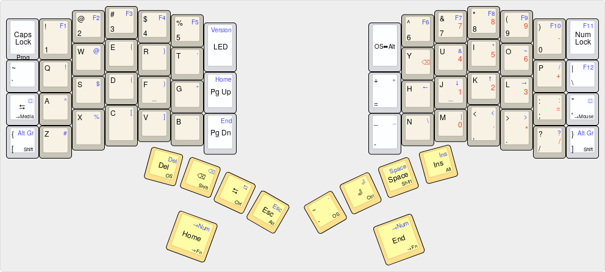

- [About the Project](#sec-1)
- [The mappings](#sec-2)
    - [Model 01 "shajra" keymap](#sec-2-0-1)
    - [Ergodox EZ "shajra" keymap](#sec-2-0-2)
- [Using these key mappings](#sec-3)
    - [1. Install Nix on your GNU/Linux distribution](#sec-3-0-1)
    - [2. Set up Cachix](#sec-3-0-2)
    - [3. Make sure your udev rules are set](#sec-3-0-3)
    - [4. For Kaleidoscope, join the necessary OS group](#sec-3-0-4)
    - [5. Unplug and replug your keyboard](#sec-3-0-5)
    - [6. Get the code and run it](#sec-3-0-6)
- [Reverting to the factory default mapping](#sec-4)
- [Customization](#sec-5)
  - [Customizing Keymaps](#sec-5-1)
  - [Development](#sec-5-2)
- [Release](#sec-6)
- [License](#sec-7)
- [Contribution](#sec-8)

[](https://github.com/shajra/shajra-keyboards/actions)

# About the Project<a id="sec-1"></a>

This project has the "shajra" keyboard mappings for two ergonomic split keyboards:

-   [Keyboardio's Model 01](https://shop.keyboard.io), programmed with [Kaleidoscope](https://github.com/keyboardio/Kaleidoscope) firmware.
-   [ZSA Technology Labs' Ergodox EZ](https://ergodox-ez.com), programmed with [QMK](https://docs.qmk.fm) firmware

Beyond the keymap, this project offers some streamlined automation with [Nix](https://nixos.org/nix) that you can use for your own keymap. We install Nix, and Nix will download and build everything we need to flash our keyboards. See [the provided documentation on Nix](doc/nix.md) for more on what Nix is, why we're motivated to use it, and how to get set up with it for this project.

The rest of this document discusses using this automation. To get the most out of the keymap itself, you may be interested in the [design document](doc/design.md) explaining the motivation behind the mapping.

# The mappings<a id="sec-2"></a>

The "shajra" keymaps for both keyboards are extremely similar, which works out well because the physical layouts of these keyboards are also similar. We can more easily switch from one keyboard to another, and retain the design benefits of the mapping.

### Model 01 "shajra" keymap<a id="sec-2-0-1"></a>



### Ergodox EZ "shajra" keymap<a id="sec-2-0-2"></a>


# Using these key mappings<a id="sec-3"></a>

This project only supports a GNU/Linux operating system with the [Nix package manager](https://nixos.org/nix) installed.

QMK and Kaleidoscope have build complexities and dependencies that can take a moment to work through. Nix can automate this hassle away by downloading and setting up all the necessary third-party dependencies in a way that

-   is highly reproducible
-   won't conflict with your current system/configuration.

By using Nix, we won't have to worry about downloading QMK or Kaleidoscope, or making sure we have the right version of build tools like Arduino installed, or messing with Git submodules, or setting up environment variables. Nix does all this for us. The provided scripts simplify using Nix even further.

The following steps will get your keyboard flashed.

### 1. Install Nix on your GNU/Linux distribution<a id="sec-3-0-1"></a>

> **<span class="underline">NOTE:</span>** You don't need this step if you're running NixOS, which comes with Nix baked in.

If you don't already have Nix, the official installation script should work on a variety of UNIX-like operating systems. The easiest way to run this installation script is to execute the following shell command as a user other than root:

```shell
curl https://nixos.org/nix/install | sh
```

This script will download a distribution-independent binary tarball containing Nix and its dependencies, and unpack it in `/nix`.

The Nix manual describes [other methods of installing Nix](https://nixos.org/nix/manual/#chap-installation) that may suit you more.

### 2. Set up Cachix<a id="sec-3-0-2"></a>

It's recommended to configure Nix to use shajra.cachix.org as a Nix *substituter*. This project pushes built Nix packages to [Cachix](https://cachix.org) as part of its continuous integration. Once configured, Nix will pull down these pre-built packages instead of building them locally.

You can configure shajra.cachix.org as a substituter with the following command:

```shell
nix run \
    --file https://cachix.org/api/v1/install \
    cachix \
    --command cachix use shajra
```

This will perform user-local configuration of Nix at `~/.config/nix/nix.conf`. This configuration will be available immediately, and any subsequent invocation of Nix commands will take advantage of the Cachix cache.

If you're running NixOS, you can configure Cachix globally by running the above command as a root user. The command will then configure `/etc/nixos/cachix/shajra.nix`, and the output will explain how to tie this configuration into your normal NixOS configuration.

### 3. Make sure your udev rules are set<a id="sec-3-0-3"></a>

To program either keyboard with a new mapping, you need to augment your OS configuration with new udev rules.

The following are recommended rules for each keyboard:

    # For Teensy/Ergodox
    ATTRS{idVendor}=="16c0", ATTRS{idProduct}=="04[789B]?", ENV{ID_MM_DEVICE_IGNORE}="1", ENV{ID_MM_PORT_IGNORE}="1"
    ATTRS{idVendor}=="16c0", ATTRS{idProduct}=="04[789A]?", ENV{MTP_NO_PROBE}="1"
    SUBSYSTEMS=="usb", ATTRS{idVendor}=="16c0", ATTRS{idProduct}=="04[789ABCD]?", MODE:="0666"
    KERNEL=="ttyACM*", ATTRS{idVendor}=="16c0", ATTRS{idProduct}=="04[789B]?", MODE:="0666"
    
    # For Kaleidoscope/Keyboardio
    SUBSYSTEMS=="usb", ATTRS{idVendor}=="1209", ATTRS{idProduct}=="2300", SYMLINK+="model01", ENV{ID_MM_DEVICE_IGNORE}:="1", ENV{ID_MM_CANDIDATE}:="0"
    SUBSYSTEMS=="usb", ATTRS{idVendor}=="1209", ATTRS{idProduct}=="2301", SYMLINK+="model01", ENV{ID_MM_DEVICE_IGNORE}:="1", ENV{ID_MM_CANDIDATE}:="0"

These settings should correspond to the official documentation:

-   [QMK documentation for configuring udev](https://github.com/qmk/qmk_firmware/tree/master/keyboards/ergodox_ez)
-   [Kaleidoscope documentation for configuring udev](https://github.com/keyboardio/Kaleidoscope/wiki/Install-Arduino-support-on-Linux)

Each distribution is different, but on many GNU/Linux systems, udev rules are put in a file in `/etc/udev/rules.d` with a ".rules" extension.

On some systems, you can activate these rules with the following commands:

```shell
udevadm control --reload-rules udevadm trigger
```

Or just restart the computer.

### 4. For Kaleidoscope, join the necessary OS group<a id="sec-3-0-4"></a>

> ***NOTE:*** You don't need this step if you're flashing the Ergodox EZ.

Once udev is configured, when you plug in the Keyboardio Model 01, a `/dev/ttyACM0` should appear. On many systems, this device is group-owned by the "dialout" or the "uucp" group:

In the following example, we can see the device is group-owned by the "dialout" group.

```shell
ls -l /dev/ttyACM0
```

    crw-rw---- 1 root dialout 166, 0 Nov 12 08:58 /dev/ttyACM0

On most distributions, the follow commands should work to join a group (substituting `$TTY_GROUP` and `$USERNAME`):

```shell
sudo usermod -a -G $TTY_GROUP $USERNAME
newgrp $TTY_GROUP
```

You should see memberships in the new group with the `groups` command:

```shell
groups | grep dialout
```

    users wheel video dialout docker

### 5. Unplug and replug your keyboard<a id="sec-3-0-5"></a>

Unplug your keyboard(s) and plug them back in, to make sure everything's set to program.

### 6. Get the code and run it<a id="sec-3-0-6"></a>

Clone this code base and go into the directory:

```shell
cd $SOME_WORKING_DIR
clone https://github.com/shajra/shajra-keyboards.git
cd shajra-keyboards
```

Note, the first time you run the commands described below, you'll see Nix doing a lot of downloading and compiling. After that, subsequent invocations should be quicker with less output.

1.  Flashing an Ergodox EZ keyboard

    You can run the following to flash your Ergodox EZ with the new keymap, pressing the reset button when prompted (access the reset button with an unbent paperclip inserted into the small hole in the top right corner of the right keyboard half):
    
    ```shell
    ./flash-ergodoxez
    ```
    
        
        Flashing ZSA Technology Lab's Ergodox EZ (custom "shajra" keymap)
        =================================================================
        
        FLASH SOURCE: /nix/store/qw018xvnib0ykhv5j2b861f1j4vhjpxb-qmk-custom-shajra-src
        FLASH BINARY: /nix/store/2swprqf95yjaqirb72r5ply2a11cfnmn-ergodoxez-custom-shajra-hex
        
        Teensy Loader, Command Line, Version 2.1
        Read "/nix/store/2swprqf95yjaqirb72r5ply2a11cfnmn-ergodoxez-custom-shajra-hex": 27376 bytes, 84.9% usage
        Waiting for Teensy device...
         (hint: press the reset button)

2.  Flashing a Keyboardio Model 01 keyboard

    You can run the following to flash your Keyboardio Model 01, holding down the `Prog` key and then pressing `Enter` when prompted:
    
    ```shell
    ./flash-model01
    ```
    
        
        Flashing Keyboardio's Model 01 (custom "shajra" keymap)
        =======================================================
        
        FLASH SOURCE: /nix/store/zbq8kccj4jmjllya1wndpjkxwj70v814-model01-custom-shajra-src
        
        BOARD_HARDWARE_PATH="/nix/store/yjnifj7vcdqbx7pyj2a98bj87fp7f9wr-kaleidoscope-src/arduino/hardware" /nix/store/yjnifj7vcdqbx7pyj2a98bj87fp7f9wr-kaleidoscope-src/arduino/hardware/keyboardio/avr/libraries/Kaleidoscope/bin//kaleidoscope-builder flash
        To update your keyboard's firmware, hold down the 'Prog' key on your keyboard.
        
        (When the 'Prog' key glows red, you can release it.)
        
        
        When you're ready to proceed, press 'Enter'.
    
    The `Prog` key is hardwired to be the top-left-most key of the Keyboardio Model 01, but the `Enter` key can be remapped. If you forget where the `Enter` has been mapped to on your Keyboard, you can hit `Enter` on another connected keyboard.

# Reverting to the factory default mapping<a id="sec-4"></a>

This project's scripts won't save off your previous keymap from your keyboard. But we can revert to the keymap that your keyboard shipped with.

This can be done with the `-F` / `--factory` switch, which both `./flash-ergodoxez` and `./flash-model01` support. Both scripts have a `-h` / `--help` in case you forget your options.

# Customization<a id="sec-5"></a>

## Customizing Keymaps<a id="sec-5-1"></a>

The provided code is fairly compact. If you look in the `keymaps` directory, you should find familiar files that you would edit in QMK or Kaleidoscope projects, respectively. These keymaps are compiled into the flashing scripts provided with this project.

For both keyboards, The "shajra" keymap is in it's own directory. You can make your own keymaps and put them in a sibling directory with the name of your choice, and they'll be compiled in as well.

If you don't want to use keymaps compiled into the flashing scripts, you can use another directory of keymaps at runtime with the `-K` / `-keymaps` switch.

Then you can use the `-k` / `--keymap` switch of either script to load your custom keymap by the name you chose for the keymap in the "keymaps" directory. The scripts should pick up changes, rebuild anything necessary, and flash your keyboard.

The used keymap source code is copied into `/nix/store`, and the invocation of the flashing scripts will print out a "FLASH SOURCE:" line indicating the source used for compiling/flashing for your reference. These are the full source trees you'd normally use if following the QMK or Kaleidoscope documentation manually.

## Development<a id="sec-5-2"></a>

This project relies heavily on Nix, primarily to help deal with all the complexity of setting up dependencies.

The [provided documentation on Nix](doc/nix.md) introduces Nix and how to use it in the context of this project.

If you want to check that everything builds before flashing your keyboard, you can build locally everything built by this project's continuous integration:

```shell
nix build --no-link --file nix/ci.nix \
    && nix path-info --file nix/ci.nix
```

    /nix/store/9ph65s0sl96fww4jbwvds4bjfky6dw5h-ergodoxez-custom-shajra-hex
    /nix/store/d7dw6qxv6m7wpx7i0gsvxjcl3ngf27v7-ergodoxez-factory-hex
    /nix/store/dxrd6p1h8dxdyw9bgndzf5kk0j3wnfxl-model01-custom-shajra-flash
    /nix/store/f7nw7fwqnkybx33j5dwb8a099qgicaz4-ergodoxez-factory-flash
    /nix/store/h663yclm1j3kls98n7qijvj50zwashbx-flash-ergodoxez
    /nix/store/lqzx88k58wzg82gifl9xs85c8k605jna-model01-factory-hex
    /nix/store/rfs9kvgmnmrl7rx4gygc5b1qsyk24b14-model01-factory-flash
    /nix/store/s08n48v72pdg9sh0njv4n4qwa636r5y3-flash-model01
    /nix/store/s8kd2a9wbfmdjanpmsifac9xgy08wdia-shajra-keyboards-licenses
    /nix/store/wmk3scljvkhxjzdwfai8za048fd8ysxv-ergodoxez-custom-shajra-flash
    /nix/store/znksmyvc4n8z5kfdj1wmaqib4ljqddvh-model01-custom-shajra-hex

# Release<a id="sec-6"></a>

The "master" branch of the repository on GitHub has the latest released version of this code. There is currently no commitment to either forward or backward compatibility. However the scripts for compiling/flashing are largely stable and are less likely to change than the "shajra" keymap.

"user/shajra" branches are personal branches that may be force-pushed to. The "master" branch should not experience force-pushes and is recommended for general use.

# License<a id="sec-7"></a>

This project is not a modified work in the traditional sense. It provides scripts the end user runs to make a modified work. Most of the source code modified (QMK, Kaleidoscope, and Model 01) is licensed under either GPLv2 or GPLv3.

If you have Nix installed, then a provided script `licenses-thirdparty` can be run to download all original source used, including license information.

In the spirit of the projects we build upon, all files in this "shajra-keyboards" project are licensed under the terms of GPLv3 or (at your option) any later version.

Please see the [COPYING.md](./COPYING.md) file for more details.

# Contribution<a id="sec-8"></a>

Feel free to file issues and submit pull requests with GitHub. Ideas for how to improve automation are welcome. If you have ideas on how to improve the "shajra" keymap, just make a compelling argument considering the factors that have already gone into [its design](doc/design.md).

There is only one author to date, so the following copyright covers all files in this project:

Copyright © 2019 Sukant Hajra
