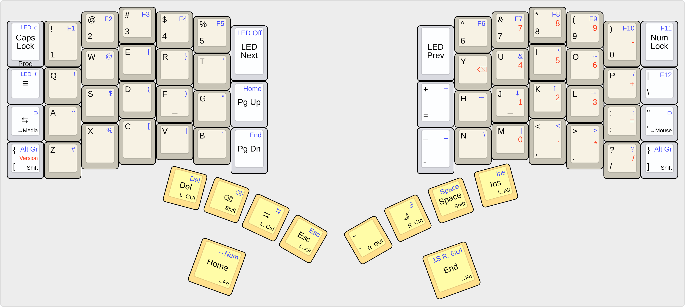
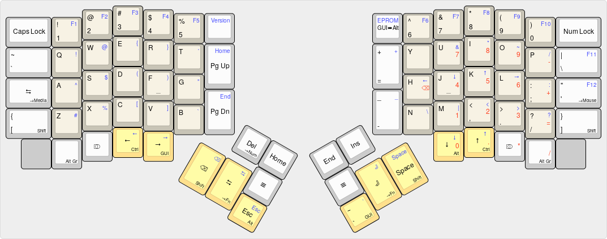

- [Designing a keyboard mapping](#sec-1)
- [Principles and assumptions](#principles_and_assumptions)
- [The keymaps](#sec-3)
  - [Model 01/100 “shajra” keymap](#sec-3-1)
  - [Ergodox EZ “shajra” keymap](#sec-3-2)
  - [Reading the keymap diagrams](#sec-3-3)
    - [Coloring](#sec-3-3-1)
    - [Modifiers](#sec-3-3-2)
- [Ergodox EZ keyboard modifications](#sec-4)
- [Principle-guided decisions](#sec-5)
  - [Core QWERTY layout](#sec-5-1)
  - [Using Mod-Tap and Qukeys](#sec-5-2)
  - [Avoid One-Shot Modifiers (OSM)](#sec-5-3)
  - [Working around a problem with Mod-Tap and Qukeys](#sec-5-4)
  - [Mapping modifiers](#sec-5-5)
  - [More on `Alt Gr` and `Compose`](#altgr_and_compose)
  - [A problem with `GUI + Enter` on Macs](#osm_right_gui)
  - [Mapping remaining non-modifiers](#sec-5-8)
  - [Mapping the Function layer](#sec-5-9)
  - [Media and Mouse layers](#sec-5-10)

# Designing a keyboard mapping

This document discusses the rationale of the “shajra” keymap for the Ergodox EZ, Moonlander, and Model 01/100 keyboards.

Having a nice ergonomic split keyboard seems a waste, only to program it with a keymap full of ergonomic setbacks. The number of possible mappings can be overwhelming. We could just choose something, good or bad, and iterate on it as we discover improvements. This process can be tedious because we have to train through the inconvenience of muscle memory to assess how well a mapping works. We get used to a key being in a poor place. So, we must be diligent not to confuse familiarity with ergonomic improvement.

To help deal with this problem, the “shajra” keymap is built upon a few guiding principles and constraints. Ideally, these principles and constraints would hone in on precisely one solution. Unfortunately, reality is not tidy, though the options narrow down some.

Keyboard customization is personal, so it's common to end up with your own keymap. Maybe the “shajra” keymap can work for you, possibly with a few tweaks.

# Principles and assumptions

Here's a list of some guiding principles that have some cascading impact on how we can map keys.

-   Prioritize ergonomics over typing speed, though speeds shouldn't be slow.
-   Satisfy the needs of typing both prose and computer programs.
-   Reward [Vim](https://www.vim.org)-style keybindings.
-   Typing too fast or too slow should not cause typos from timing problems.
-   The mode/state the keyboard is in should be straightforward and predictable.
-   All reasonable modifier combinations should be possible, most ergonomically.
-   Paired keys should be adjacent or symmetrically laid out.
-   Support convenient one-handed use where possible.
-   If no other factors apply, lean on familiarity with common layouts.
-   The keymapping should support the entry of non-standard characters, but English will be the dominant language typed.

Additionally, there are a few physical assumptions that factor into some decisions:

-   The original author has larger hands, which means some keys are assumed reachable, which may not be the case for everyone.
-   For the Ergodox EZ, the original author has also modified the switches and keycaps to make more keys accessible by thumb keypresses.

# The keymaps

For reference, below are diagrams of the “shajra” keymaps for the Model 01/100 and Ergodox EZ.

## Model 01/100 “shajra” keymap

## Ergodox EZ “shajra” keymap

Note the Moonlander keyboard is an almost identical layout to the EZ and not illustrated here. The Moonlander has only two fewer keys on the thumb cluster. This leads to not having either Home or End on the base layer for the Moonlander (they are still in a function layer). And the "application menu" keycodes are moved to the bottom-outer corners.

## Reading the keymap diagrams

### Coloring

-   Black labels represent the Base layer.
-   Blue labels represent the Function layer.
-   Red labels represent the Num Pad layer.
-   Yellow keys should be easily pressed by thumbs or palms.
-   Beige keys are core keys, easily pressed by fingers.

### Modifiers

Various platforms have diverged in the names and purpose of their modifier keys. A useful simplification, the USB HID tables, force these divergences to converge with modern USB-based keyboards:

| USB HID key | Non-Mac key | Mac key     |
|----------- |----------- |----------- |
| `GUI`       | `⊞ Windows` | `⌘ Command` |
| `Alt`       | `⎇ Alt`     | `⌥ Option`  |
| `Control`   | `^ Control` | `^ Control` |
| `Shift`     | `⇧ Shift`   | `⇧ Shift`   |

The keymaps use the USB HID terminology. On the images, the lower-right corner label on some keys shows the modifier accessed by holding it (other labels reference keycodes accessed by tapping).

In addition to standard modifiers, there are a few extra supported by firmware:

-   The “Alt Gr” label represents a [`Alt Graph` modifier](https://en.wikipedia.org/wiki/AltGr_key), which we emulate with the `Right Alt` keycode.
-   The “⎄” label represents a [`Compose` key](https://en.wikipedia.org/wiki/Compose_key), which we emulate with `Shift + Right Alt`.
-   There are “media” and “mouse” layers that are not shown in these diagrams to avoid clutter.

Note that we've given some special treatment to the right and left `Alt` keycodes. This is explained more [later](#altgr_and_compose).

# Ergodox EZ keyboard modifications

There are two problems one might find with the stock Ergodox EZ keyboard. Other supported keyboards don't have these problems.

-   four of the bottom row keys (the yellow keys assigned arrow keycodes in the diagram above) are more easily accessible by thumbs, but the provided keycaps may not well accommodate thumb presses

-   the 2u keycaps in the thumb cluster tend to bind with offset keypresses (the Ergodox EZ doesn't have stabilizers on any keys).

Fortunately, the Ergodox EZ allows for easy customization not only of keycaps, but also switches (without soldering).

By replacing the switches with something smoother and lighter like [Zilent 62g switches](https://zealpc.net/products/zilents), we can reduce the likelihood of binding.

To further reduce binding, the 2u keycaps of the thumb cluster can be replaced with 1.5u keycaps. Another benefit is that the 1.5u keycap leaves a gap between it and any keycap right above it, which makes it easier to press a 1u key above without accidentally pressing the 1.5u key below. This gap is illustrated in the Ergodox EZ diagram above.

If your Ergodox EZ shipped with DSA (unsculptured) keycaps, you may find you can conveniently press all the yellow keys in the keymap diagram with your thumbs.

If your Ergodox shipped with DCS (sculptured) keycaps, you will likely find the four bottom row keys (mentioned earlier) sculptured too sharply for comfortable thumb presses. Replacing these keycaps is recommended to use the “shajra” keymap.

[Signature Plastics](https://pimpmykeyboard.com/key-cap-family-specs) is a popular place to get alternate keycaps. If you do get keycaps from a third party like Signature Plastics, consider the G20 keycaps, which work well for thumb presses because of their low profile and rounded edges.

# Principle-guided decisions

Here are a few decisions that fell from the principles mentioned earlier.

## Core QWERTY layout

Alternative layouts may have some merits, but the time commitment to learn a new layout seems steep for what may only be a slight improvement in typing speed or ergonomic comfort.

Furthermore, the most common ergonomic layouts like Colemak or Dvorak move the `h`, `j`, `k`, and `l` keys used by Vim-style keybindings for navigation. Many applications use Vim-style keybindings these days, and it's too much work to rebind them all at the application level.

For keys easily reached by fingers (the beige keys in our diagrams), we'll use a QWERTY layout. This includes letters, numbers, and also `,`, `.`, `/`, and `;`.

If we want something like Colemak or Dvorak we could implement it later as a layer to toggle to/from. But QWERTY will be the base.

## Using Mod-Tap and Qukeys

With the Ergodox EZ, Moonlander, and Model 01/100, we get new keys that can get much more utility from our thumbs/palms, which are sturdier than any of our fingers. Our thumbs/palms get home keys of their own (the Model 01/100 even has physical homing bumps on its thumb keys). These keys are a central feature of both keyboards.

In traditional keyboards, commonly pressed keys like `Enter` and `Shift` are pressed by pinky fingers (the hand's weakest) and are not close to home keys. These keys are great candidates to move towards the new thumb/palm home keys made available.

To further capitalize on these thumb/palm keys, We can use QMK's [Mod-Tap](https://docs.qmk.fm/#/mod_tap) or Kaleidoscope's [Qukey](https://kaleidoscope.readthedocs.io/en/latest/plugins/Qukeys.html) features to allow each key to share both a modifier and a non-modifier keycode. The modifier is accessed when holding the key, and the non-modifier when tapping the key. In our diagrams, the modifier of a Mod-Tap/Qukey-enhanced key is labeled in its lower-right corner. The key's other labels indicate other keycodes sharing the key.

Mod-Tap/Qukey is not suitable for every key, though. It can lead to some typos when typing fast, especially with a hint of rollover that can register as an accidental hold. For this reason, it's not good to use it with standard alphanumeric keys. So, we won't use Mod-Tap for our core QWERTY keys (the beige keys).

## Avoid One-Shot Modifiers (OSM)

Thus far, we've presumed that modifiers need to be oriented such that we can chord them expressively and ergonomically. However, [Kaleidoscope's OneShot plugin](https://kaleidoscope.readthedocs.io/en/latest/plugins/OneShot.html) and [QMK's One-Shot feature](https://docs.qmk.fm/#/one_shot_keys) allow us to use tapping to emulate holding a modifier.

Unfortunately, One-Shot is incompatible with Mod-Tap/Qukeys, which we've reasoned above will help us get more keycodes closer to our thumb/palm home keys.

This incompatibility introduces a design tension. Some would argue that chording increases the likelihood of repetitive stress injury. Traditional keyboards put a lot of the stress on pinky fingers by having them hold keys while stretching from their home position. A One-Shot approach removes the need to hold the keys but may not necessarily move the key to a better location. The pinky finger may still need to stretch for the keypress.

Instead, the “shajra” keymap uses Mod-Tap/Qukeys to reduce the need to hold and even stretch our pinkies to farther keys. It does this not only for modifiers (like `Shift` and `Ctrl`), but also common keycodes (like `Tab`, `Esc`, `Enter`, and `Backspace`). The key-sharing of Mod-Tap/Qukeys allows us to map all of these to our thumbs/palms. With One-Shot, without keycodes sharing keys, we will invariably have some of these commonly used keycodes spill into the outer keys stretched to by our pinkies. With Mod-Tap/Qukeys, we generally shouldn't find our pinkies having to reach beyond the beige keys in our diagrams.

For these reasons, we'll mostly avoid One-Shot, and prefer Mod-Tap/Qukeys instead.

## Working around a problem with Mod-Tap and Qukeys

With Kaleidoscope, when we use Qukeys, we lose the ability to hold a key and have it repeat (because holding a key registers as the modifier sharing the key instead). Using some keys like `Space` and `Backspace` can be annoying without a repeating hold.

QMK has a feature where you can tap a Mod-Tap key quickly before holding it to have it register as a repeating hold. Unfortunately, this can lead to typos when typing fast. For instance, if we assigned `Space` and `Shift` to the same key, then if we typed a space too quickly right before shifting (say for a capital letter), Mod-Tap would register the hold as a repeating space instead. As mentioned in [our principles](#principles_and_assumptions) earlier in this document, we don't want to have these kinds of timing problems.

Fortunately, there's a workaround. We can use the Function layer to overlay on top of any keycode that can't repeat the same keycode for repeating. So, in our example, if we collocated `Space` and `Shift` in the same key with Mod-Tap/Qukey, but used our workaround, we could chord and hold `Function+Space` to get a repeating space. This workaround seems manageable for the few common keys we have collocated with modifiers using Mod-Tap/Qukeys.

The “shajra” keymap uses this workaround, and you can see it used for the thumb keys in the keymap diagrams above.

## Mapping modifiers

The modifiers below have been ordered from most frequently used to least:

| Modifier   | Other common keyboard labels |
|---------- |---------------------------- |
| `Shift`    | `⇧`                          |
| `Function` | `Fn`                         |
| `GUI`      | `Win` `Cmd` `❖` `⌘`          |
| `Ctrl`     | `✲`                          |
| `Alt`      | `Option` `⎇` `⌥`             |
| `Media`    |                              |
| `Mouse`    |                              |
| `Alt Gr`   |                              |

Though the order above is subjective to a degree, the `Shift` and `Function` modifiers are more obviously used the most. We'll want these modifiers near our thumb home keys so that we stay in one position as much as possible when typing prose.

Ideally, we want each modifier on both the left and right keyboard halves. We get a more comfortable reach with the fingers of one hand when using the thumb of the other hand for a modifier. And we want to be able to modify keys on either half with similar ease. We mostly get modifiers on both halves, which will be discussed more in a [later section](#osm_right_gui).

Modifiers on both left and right halves allow us to chord more modifier combinations. If the two modifiers we needed were on the same split, we'd be out of luck with only one thumb per hand.

Modifiers on both sides also allow occasional one-handed chording if our other hand is off the keyboard. To further support one-handed chording, we want the `Ctrl`, `Alt`, and `GUI` keys pressed by thumbs. Note that when pressing one of the yellow keys with our thumbs, all fingers can press a key. If we use a pinky finger for a modifier, other keys typically depressed by the pinky are less available for a one-handed chord. The same is true for any of our fingers. When we use our thumbs for modifiers, more chords are ergonomically available for one-handed chording in a home position.

Three-modifier chording is sometimes required. For this reason, we have `Shift` modifiers on both thumb keys as well as their traditional outer keys. Thumbs of each hand would press the other two modifiers, while one of the pinkies presses a `Shift`.

There are a few other chords not ergonomically supported. If we have two modifiers of `Alt`, `GUI`, or `Ctrl`, combined with a non-modifier of `Del`, `Space`, or `Enter`, all these are on thumb keys as laid out in the “shajra” keymap (and we only have two thumbs!). But these chords shouldn't be too common (despite including the famous `Ctrl+Alt+Del`). If they do arise, we can move one of our hands from home to press the modifiers we need with our fingers while pressing the non-modifier with the other hand.

In the “shajra” keymap, you'll notice that the modifiers line the bottom keys pressed by thumbs/keys and wrap around to some modifiers accessed by pinky fingers. The Mouse and Media layers are designed to be used while chording with a pinky modifier. Fortunately, we don't access these layers too often, so our pinky fingers shouldn't get too tired.

Most of the modifiers are laid out symmetrically, with one exception. One half swaps the `Alt` and `GUI` locations of the other half. This swap keeps more modifier combinations closer to home positions.

## More on `Alt Gr` and `Compose`

Historically, some keyboards targetting an international audience provide a [`Alt Graph` (`Alt Gr`) modifier](https://en.wikipedia.org/wiki/AltGr_key) where a `Right Alt` key would be (and thus only one `Alt` key on the left side). With this modifier some operating systems would support entry of a variety of currency and language symbols (such as “€” or “ä”) beyond those on a standard US/English keyboard.

On Macs, both left and right `Option` (`⌥`) keys help enter alternate symbols similarly to an `Alt Gr` key. And keyboards that emit the `Alt` keycodes are interpreted by Macs as an `Option` keycodes.

On GNU/Linux and Windows, the `Right Alt` keycode can be configured to serve as an `Alt Gr` key, leaving the `Left Alt` available for user/application/OS keybinding. Similarly, some terminal emulators on Macs are often configured to have the `Left Option` emit escaped character codes, more like a traditional `Alt` key than an `Alt Gr` one.

Under the assumption that the `Right Alt` modifier may be used (as an `Alt Gr` key) differently from the `Left Alt` modifier, the “shajra” keymap puts each on both the right and left sides. This way, we can retain the benefits of having the same modifier on both sides as we have for all our other modifiers.

The “shajra” keymap makes this `Alt Gr` keys a One-Shot Modifier (OSM) to make it easier to use. Note that due to limited space on the Model 01/100, the `Right Alt` (`Alt Gr`) keycode is placed in the Function layer. Hopefully, as an OSM, this modifier will still be convenient enough despite being in a Function layer.

Note that on GNU/Linux, `Shift+Right Alt` is often configured to be a [`Compose` (`⎄`) key](https://en.wikipedia.org/wiki/Compose_key), which serves a similar function to an `Alt Gr` key. The significant difference is that `Compose` keys are one-shot (tapped, not held) by nature and, therefore, not a traditional modifier.

Because they are similar in function, the `Alt Gr` and `Compose` keys are placed adjacent to one another in all “shajra” keymaps.

## A problem with `GUI + Enter` on Macs

On Linux systems, the `GUI` (`Windows` key) modifier isn't used by the operating system of applications, leaving it broadly available for user shortcuts. However, this isn't the case for Mac OS and various Mac applications, which assign shortcuts liberally to the `Command` key.

The `Option` key on the Mac isn't available for user shortcuts either because applications use it as well, not to mention the complexity we already have with `Compose` and `Alt Gr` emulation.

To avoid conflicts, we're forced to use the left `GUI` key for user shortcuts, which leaves the right `GUI` key for standard Mac shortcuts. Though we have a `GUI` key on both halves, they aren't the same in practice. Consequently, we lose some ergonomic benefits.

This loss is apparent on the “shajra” keymap if we need both a `Left GUI + Enter` shortcut and a `Right GUI + Enter` shortcut. Perhaps some applications don't give us a choice. `Right GUI` and `Enter` are both thumb-depressed keys on the right-hand split. We'd have to lift our right hand from home position to use our fingers.

We could move some keys in our keymap to keep from lifting our fingers. But that would move the problem to another shortcut. Or we might have to sacrifice the ergonomics benefits of depressing modifiers with our thumbs. The “shajra” keymap offers a more general solution by providing a One-Shot Modifer (OSM) of the right `GUI` key on the function layer. It requires another keypress, but our hands don't need to leave home position.

To hit the specific shortcut of `Right GUI + Enter`, you hold down the right `Function` modifier to tap the left `Function` key. That engages the OSM. You can then hit `Enter`. The OSM will stay engaged for a few seconds, and then the keyboard will return to its normal state.

Hopefully, this is an agreeable solution for a specific scenario where you want both `Left GUI + Enter` and `Right GUI + Enter` shortcuts. This scenario is more likely on Macs, and even then, not for everyone.

Another solution, not implemented, could be to put Mod-Tap modifiers on normal keys, but this can lead to subtle typos, especially when typing fast.

## Mapping remaining non-modifiers

Because we've decided to support chording with Mod-Tap/Qukeys, we want our Base layer to have all the keys commonly used for applications keybinds. Otherwise, when chording, we also need the `Function` modifier. Of the keys on a full 104-key keyboard, we may not have room for the function keys, the numpad, and some less used keys like `Print Screen`, `Scroll Lock`, and `Pause`. But we should have the rest on our base layer.

The following non-modifier keycodes below have been ordered from the most frequently used to least:

| Keycode                    | Commonly used icons | Notes on usage                                             |
|-------------------------- |------------------- |---------------------------------------------------------- |
| `Space`                    | `␣`                 | essential for all tasks                                    |
| `Backspace`                | `⌫`                 | essential for all tasks (mistakes happen)                  |
| `Enter`                    | `⏎`                 | essential for all tasks                                    |
| `'`                        |                     | apostrophes common in text, but historically next to `;`   |
| `Esc`                      | `⎋`                 | essential for Vim-style keybinds                           |
| `Tab`                      | `↹`                 | useful for shell/programming tab-complete                  |
| `-` `=`                    |                     | CLI switches, "zoom" keybindings, common in programming    |
| `Left` `Right` `Down` `Up` | `⬅` `➡` `⬇` `⬆`     | useful in a variety of contexts                            |
| `` ` ``                    |                     | common in "markdown" languages for verbatim text           |
| `Page Down` `Page Up`      | `⇟` `⇞`             | useful when reading a large page                           |
| `[` `]`                    |                     | occurs occasionally when programming                       |
| `\`                        |                     | used for delimiting and more commonly shifted to get a `\` |
| `Insert` `Delete`          | `⎀` `⌦`             | occasionally useful (`Shift-Insert` for pasting)           |
| `Home` `End`               | `↖` `↘`             | useful for navigating text fields                          |

This ordering is subjective to some degree and undoubtedly context-sensitive. However, `Space`, `Backspace`, and `Enter` are clearly used more than the rest.

To increase ergonomics the “shajra” keymap maps the keycodes above in order of usefulness, first to good thumb keys, then good index finger keys, and lastly, pinky keys. There is one notable exception, though. The single quote `'` key in a QWERTY layout has a history of placement next to the semicolon `;` key. And for many touch typers, this is deeply ingrained in memory. The pinky does not stretch far to reach this key, so we'll continue to place `'` there. As an alternative, the single quote is also in our Function layer.

Also, we've tried to keep naturally paired keys either adjacent or symmetrically balanced across the two keyboard halves.

## Mapping the Function layer

There are a few ways to lay out keycodes in the Function layer. Here are some reasons for how the keycodes on the Function layer are mapped in the “shajra” keymap:

| Keycode                    | Notes on placement                                              |
|-------------------------- |--------------------------------------------------------------- |
| `!` `@` `&` `*`            | placed a row below their shifted counterparts on the Base layer |
| `^` `$`                    | adjacent for their usage within regular expressions             |
| `#` `%`                    | adjacent for their usage in Shell parameter substitution        |
| `Home` `End`               | over the Base layer's `Page Up` and `Page Down`                 |
| `(` `)` `[` `]` `{` `}`    | balanced enclosing marks are adjacent                           |
| `` ` `` `'` `"`            | all these quotes are adjacent                                   |
| `Left` `Down` `Up` `Right` | placed above `h`, `j`, `k`, and `l` for Vim-style navigation    |
| `~` `/`                    | adjacent because home directories are prefixed “~/”             |
| `+` `_` `<` `>` `?` `:`    | placed such that `Function` is the same as `Shift`              |

Regarding the last item in this table, some keys already exist from our Base layer with shifting, but it's nice to have all our symbols on one layer, so we don't have to toggle between switching between shifting the Base layer and toggling the Function layer (for example, this occurs with programming operators such as `<*>`, and `<$>`).

## Media and Mouse layers

This project doesn't provide diagrams of the Media or Mouse layers, but hopefully you can follow the code for these layers in the respective code for the [Ergodox EZ](https://github.com/shajra/shajra-keyboards/blob/main/keymaps/ergodox_ez/shajra/keymap.c#L102-L142), [Moonlander](https://github.com/shajra/shajra-keyboards/blob/main/keymaps/moonlander/shajra/keymap.c#L55-L70), [Model 01](https://github.com/shajra/shajra-keyboards/blob/main/keymaps/model_01/shajra/Model01.ino#L113-L144), and [Model 100](https://github.com/shajra/shajra-keyboards/blob/main/keymaps/model_100/shajra/Model100.ino#L113-L144).

While holding a pinky to enter the layer, both layers offer keys laid out in a directional orientation, accessed by fingers. Some thumb keys are also used. These layers were more creatively laid out, but hopefully, they are intuitive enough to commit to memory.
